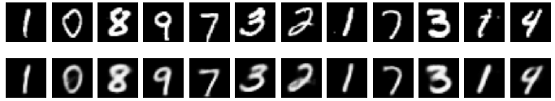

# Building and Running GANs, SR-GANs and VAEs on Icons

## GANs

## SRGANs

## VAEs

This repository provides these from-scratch implementations:

- Generative Adversarial Networks
- Super Resolution Generative Adversarial Networks
- Variational Autoencoders

## Running the Analysis

You can run the specific notebook for each method to execute full train-inference pipeline.